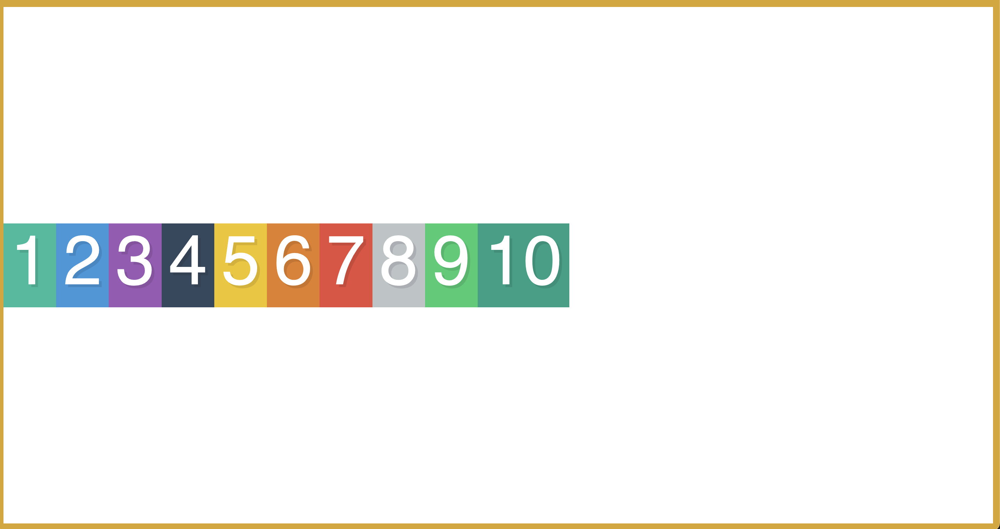
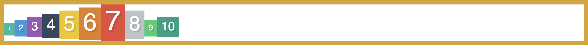

# About alignment and centering

## 1] With `justify-content`

Starting with our basic html and CSS files, we have the following:


Now, let's start to play with the CSS by adding a `justify-content` property to the `.container` class:

```css
.container {
  display: flex;
  justify-content: center;
  border: 10px solid goldenrod;
}
```

(I added a border to the container so we can see where it is)

What does `justify-content` do? It aligns the flex items along the main axis which is, by default, horizontally from left to right. Here with `justify-content: center;` we are telling the flex items to be centered along the main axis, giving us the following:


The other values that can be used for `justify-content` are: `flex-start`, `flex-end`, `space-between`, `space-around`, and `space-evenly`. The following link has a great visual demo of each of these values: https://css-tricks.com/snippets/css/a-guide-to-flexbox/#aa-justify-content.

## 2] With `align-items`

`align-items` behaves very similarly to `justify-content`. It aligns the flex items along the cross axis which is, by default, vertically from top to bottom. Like we did above with `justify-content`, let's add `align-items: center;` to the `.container` class of our CSS file:

```css
.container {
  display: flex;
  align-items: center;
  height: 100vh;
  border: 10px solid goldenrod;
}
```

(I added a height to the container so that there is enough room for the flex items and let us see the alignment)

This gives us the following:



As pointed out in Wes Bos' video, the coolest looking value for `align-items` is `baseline`, which makes sure that the all the text in the flex items are on the same baseline. If we do the the following:

```css

.container {
  display: flex;
  align-items: baseline;
  border: 10px solid goldenrod;
}

.box1 {
  font-size: 10px;
}

.box2 {
  font-size: 20px;
}

.box3 {
  font-size: 30px;
}

.box4 {
  font-size: 40px;
}

.box5 {
  font-size: 50px;
}

.box6 {
  font-size: 60px;
}

.box7 {
  font-size: 70px;
}

.box8 {
  font-size: 50px;
}

.box9 {
  font-size: 20px;
}

.box10 {
  font-size: 30px;
}
```

We get:



Very cool in my opinion!