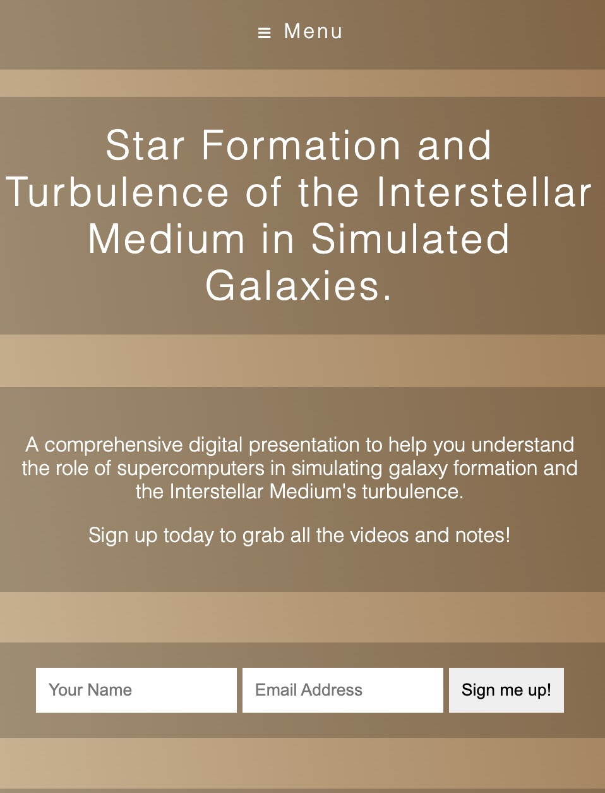

# Flexbox, mobile content reordering

## Introduction

We are going to see how to reorganise the content of a webpage using flexbox. This is useful when we switch from mobile to desktop view for instance. It's a good follow-up to the previous post about a flexbox navigation bar.

Currently, our page looks like this:


Nothing special about the HTML and CSS files:
  
```html
<!DOCTYPE html>
<html lang="en">
<head>
  <meta charset="UTF-8">
  <title>Galaxy Formation Workshop</title>
  <link rel="stylesheet" href="https://maxcdn.bootstrapcdn.com/font-awesome/4.3.0/css/font-awesome.min.css">
  <link rel="stylesheet" href="style.css">
</head>
<body>
  
  <div class="wrapper">
    
    <header class="top">
      <h1><a href="#">Star Formation and Turbulence of the Interstellar Medium in Simulated Galaxies.</a></h1>
    </header>

    <nav class="flex-nav">
      <a href="#" class="toggleNav">☰ Menu</a>
      <ul>
        <li><a href="#">Kennicutt-Schmidt law</a></li>
        <li><a href="#">Gravitational instability</a></li>
        <li><a href="#">The role of Turbulence</a></li>
        <li><a href="#">Numerical simulation</a></li>
        <li><a href="#">Adaptive Mesh Refinement</a></li>
        <li><a href="#">Supernova Feedback</a></li>
      </ul>
    </nav>

    <section class="hero">
      
    </section>

    <section class="details">
      <p>A comprehensive digital presentation to help you understand the role of supercomputers in simulating galaxy formation and the Interstellar Medium's turbulence.</p>
      <p>Sign up today to grab all the videos and notes!</p>
    </section>

    <section class="signup">
      <form action="" class="signup">
        <input type="text" placeholder="Your Name">
        <input type="email" placeholder="Email Address">
        <input type="submit" value="Sign me up!">
      </form>
    </section>

    <footer>
      <p>&copy; Dr. Frédéric Robert</p>
    </footer>


  </div>

  <script src="https://ajax.googleapis.com/ajax/libs/jquery/1.11.2/jquery.min.js"></script>
  <script>
    
    $(function() {
      $('.toggleNav').on('click',function() {
        $('.flex-nav ul').toggleClass('open');
      });
    });

  </script>
</body>
</html>
```

```css
/* Some CSS Setup - nothing to do with flexbox */
html {
  box-sizing: border-box;
}

*, *:before, *:after {
  box-sizing: inherit;
}

body {
  font-family: sans-serif;
  margin: 0;
  background-image: linear-gradient(260deg, #a67c52 0%, #d3b997 100%);
}

a {
  color:white;
  font-weight: 100;
  letter-spacing: 2px;
  text-decoration: none;
  background:rgba(0,0,0,0.2);
  padding:20px 5px;
  display: inline-block;
  width: 100%;
  text-align: center;
  transition:all 0.5s;
}

a:hover {
  background:rgba(0,0,0,0.3);
}

.toggleNav {
  display: none;
}

img {
  width:100%;
}

.wrapper {
  max-width: 1000px;
  margin: 0 auto;
}

input {
  padding:10px;
  border:0;
}


section, footer {
  text-align: center;
  background:rgba(0,0,0,0.2);
  padding:20px;
  margin:20px 0;
  color:white;
  font-weight: 100;
}

/* Flex Container */
.flex-nav ul {
  border:1px solid black;
  list-style: none;
  margin: 0;
  padding: 0;
}

@media all and (max-width:1000px) {

}


@media all and (max-width:500px) {
  
}
```

## Familiar territory with the navbar

We start with the following for the flexbox related CSS:

```css
/* Flex Container */
.flex-nav ul {
  border:1px solid black;
  list-style: none;
  margin: 0;
  padding: 0;
  display: flex;
}

/* Flex item */
.flex-nav li {
  flex: 1;
}

@media all and (max-width:1000px) {
  .flex-nav ul {
    flex-wrap: wrap;
  }

  .flex-nav li {
    flex: 1 1 50%;
  }
}


@media all and (max-width:500px) {
  .flex-nav li {
    flex-basis: 100%;
  }
}
```

This is in the same spirit as what we did for the flexbox navigation bar. If we decrease the size of the window, the navigation bar will reorganise itself. So far, so good.


## Reordering the content

Let's start with the following :
```css
  /* Flex container */
  .wrapper {
    display:flex;
    flex-direction:column;
  }
```
We turn the wrapper into a flex container and we set the direction to column. This means that the children of the wrapper, the header, the nav, the sections and the footer, will be stacked vertically. We make sure of the latter by using `flex-direction:column`.

Now, we add:

```css
  /* Flex item */
  .wrapper > * {
    order: 99
  }

  .flex-nav {
    order: 1;
  }
```

The first part of the CSS code sets the order of the flex items to 99, placing them at the end of the flex container. By default the order of the different items is 9. So, by having a high number like 99, we make sure that the items will be placed at the end of the flex container. Therefore, with the navigation bar having an order of 1, it will be put at the top of the flex container.

To then close the navigation bar, we add the following:

```css
  .toggleNav {
    display: block;
  }

  .flex-nav ul {
    display: none;
  }

  .flex-nav ul.open {
    display: flex;
  }
```
The first two blocks of code are used to hide the navigation bar. The remaining block of code is used to display it when we click on the `toggleNav` button.

Finally, we reorder the rest of the items with: 
  
  ```css
  .top {
    order: 2;
  }

  .details {
    order: 3;
  }

  .signup {
    order: 4;
  }
  ```

  Nothing really special here. Our webpage now looks like this when we reduce the size of the window:

  

  That's it! We have successfully reordered the content of our webpage and adding a toggle button to open/close the (flexbox) navigation bar. 