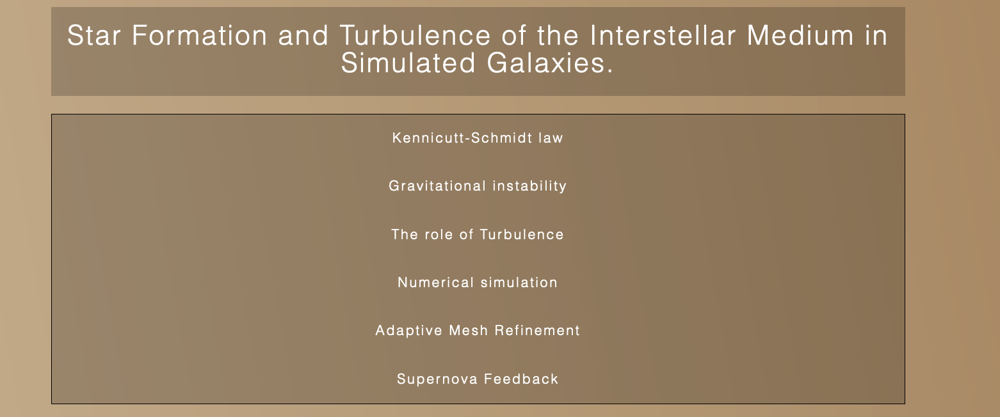
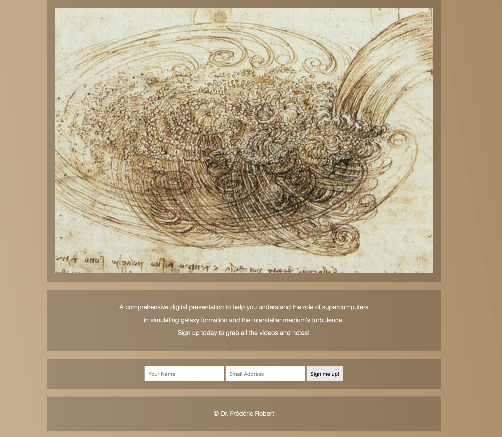

# Flexbox, mobile content reordering

## Introduction

We are going to see how to reorganise the content of a webpage using flexbox. This is useful when we switch from mobile to desktop view for instance. It's a good follow-up to the previous post about a flexbox navigation bar.

Currently, our page looks like this:





Nothing special about the HTML and CSS files:
  
```html
<!DOCTYPE html>
<html lang="en">
<head>
  <meta charset="UTF-8">
  <title>Galaxy Formation Workshop</title>
  <link rel="stylesheet" href="https://maxcdn.bootstrapcdn.com/font-awesome/4.3.0/css/font-awesome.min.css">
  <link rel="stylesheet" href="style.css">
</head>
<body>
  
  <div class="wrapper">
    
    <header class="top">
      <h1><a href="#">Star Formation and Turbulence of the Interstellar Medium in Simulated Galaxies.</a></h1>
    </header>

    <nav class="flex-nav">
      <a href="#" class="toggleNav">☰ Menu</a>
      <ul>
        <li><a href="#">Kennicutt-Schmidt law</a></li>
        <li><a href="#">Gravitational instability</a></li>
        <li><a href="#">The role of Turbulence</a></li>
        <li><a href="#">Numerical simulation</a></li>
        <li><a href="#">Adaptive Mesh Refinement</a></li>
        <li><a href="#">Supernova Feedback</a></li>
      </ul>
    </nav>

    <section class="hero">
      
    </section>

    <section class="details">
      <p>A comprehensive digital presentation to help you understand the role of supercomputers in simulating galaxy formation and the Interstellar Medium's turbulence.</p>
      <p>Sign up today to grab all the videos and notes!</p>
    </section>

    <section class="signup">
      <form action="" class="signup">
        <input type="text" placeholder="Your Name">
        <input type="email" placeholder="Email Address">
        <input type="submit" value="Sign me up!">
      </form>
    </section>

    <footer>
      <p>&copy; Dr. Frédéric Robert</p>
    </footer>


  </div>

  <script src="https://ajax.googleapis.com/ajax/libs/jquery/1.11.2/jquery.min.js"></script>
  <script>
    
    $(function() {
      $('.toggleNav').on('click',function() {
        $('.flex-nav ul').toggleClass('open');
      });
    });

  </script>
</body>
</html>
```

```css
/* Some CSS Setup - nothing to do with flexbox */
html {
  box-sizing: border-box;
}

*, *:before, *:after {
  box-sizing: inherit;
}

body {
  font-family: sans-serif;
  margin: 0;
  background-image: linear-gradient(260deg, #a67c52 0%, #d3b997 100%);
}

a {
  color:white;
  font-weight: 100;
  letter-spacing: 2px;
  text-decoration: none;
  background:rgba(0,0,0,0.2);
  padding:20px 5px;
  display: inline-block;
  width: 100%;
  text-align: center;
  transition:all 0.5s;
}

a:hover {
  background:rgba(0,0,0,0.3);
}

.toggleNav {
  display: none;
}

img {
  width:100%;
}

.wrapper {
  max-width: 1000px;
  margin: 0 auto;
}

input {
  padding:10px;
  border:0;
}


section, footer {
  text-align: center;
  background:rgba(0,0,0,0.2);
  padding:20px;
  margin:20px 0;
  color:white;
  font-weight: 100;
}

/* Flex Container */
.flex-nav ul {
  border:1px solid black;
  list-style: none;
  margin: 0;
  padding: 0;
}

@media all and (max-width:1000px) {

}


@media all and (max-width:500px) {
  
}
```