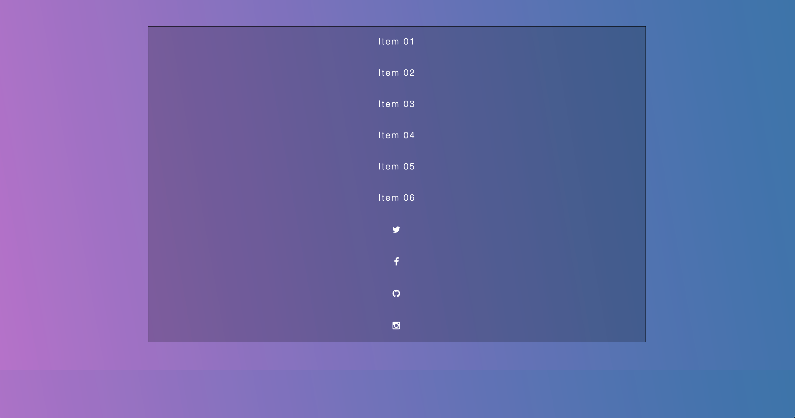

# Flexbox, creating a flexbox navigation bar

## Introduction 

We start with the following HTML:

```html
<!DOCTYPE html>
<html lang="en">
<head>
  <meta charset="UTF-8">
  <meta name="viewport" content="width=device-width, initial-scale=1">
  <title>FlexBox Nav</title>
  <link rel="stylesheet" href="https://maxcdn.bootstrapcdn.com/font-awesome/4.3.0/css/font-awesome.min.css">
  <link rel="stylesheet" href="style.css">
</head>
<body>
  <div class="wrapper">

    <nav class="flex-nav">
      <ul>
        <li><a href="#">Item 01</a></li>
        <li><a href="#">Item 02</a></li>
        <li><a href="#">Item 03</a></li>
        <li><a href="#">Item 04</a></li>
        <li><a href="#">Item 05</a></li>
        <li><a href="#">Item 06</a></li>
        <li class="social">
          <a href="http://twitter.com/wesbos"><i class="fa fa-twitter"></i></a>
        </li>
        <li class="social">
          <a href="http://facebook.com/wesbos.developer"><i class="fa fa-facebook"></i></a>
        </li>
        <li class="social">
          <a href="http://github.com/wesbos"><i class="fa fa-github"></i></a>
        </li>
        <li class="social">
          <a href="http://instagram.com/wesbos"><i class="fa fa-instagram"></i></a>
        </li>
      </ul>
    </nav>

  </div>

</body>
</html>
```

and the following CSS:

```css
/* Some CSS Setup - nothing to do with flexbox */
html {
  box-sizing: border-box;
}

*, *:before, *:after {
  box-sizing: inherit;
}

body {
  font-family: sans-serif;
  margin: 0;
  background-image: linear-gradient(260deg, #2376ae 0%, #c16ecf 100%);
}

a {
  color:white;
  font-weight: 100;
  letter-spacing: 2px;
  text-decoration: none;
  background:rgba(0,0,0,0.2);
  padding:20px 5px;
  display: inline-block;
  width: 100%;
  text-align: center;
  transition:all 0.5s;
}

a:hover {
  background:rgba(0,0,0,0.3);
}

.wrapper {
  max-width: 1000px;
  margin: 0 auto;
  padding:50px;
}

/* Flex Container */
.flex-nav ul {
  border:1px solid black;
  list-style: none;
  margin: 0;
  padding: 0;
  
}

@media all and (max-width:1000px) {
}

@media all and (max-width:500px) {
}
```
Please note that our focus in the CSS file is on the `.flex-nav ul` selector. Everything is mostly about having the page looking good.

Our page initially looks like this:



## working on the flex container