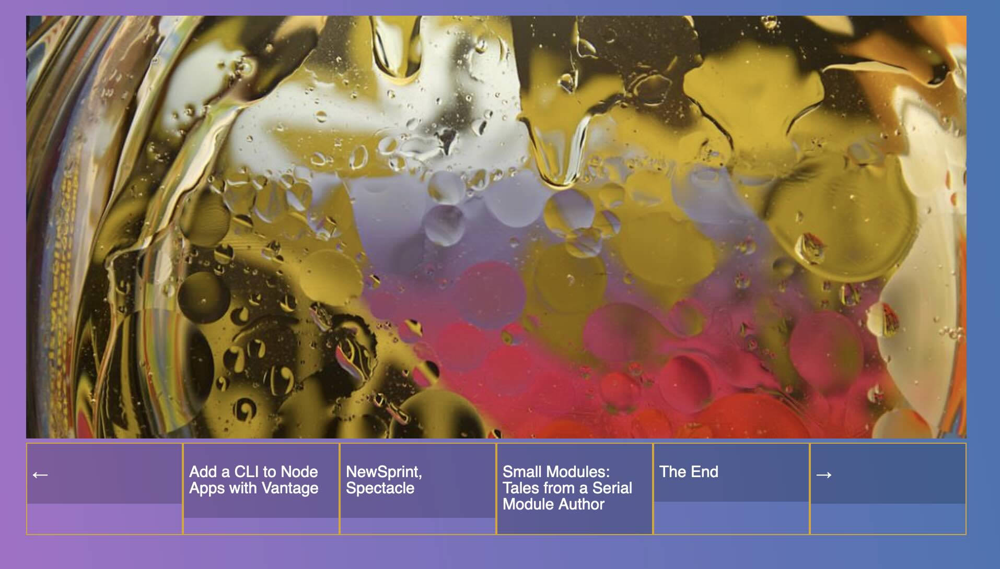
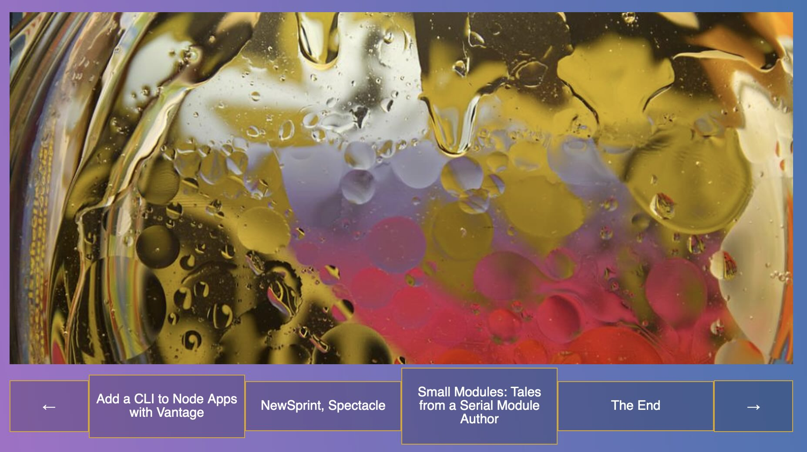
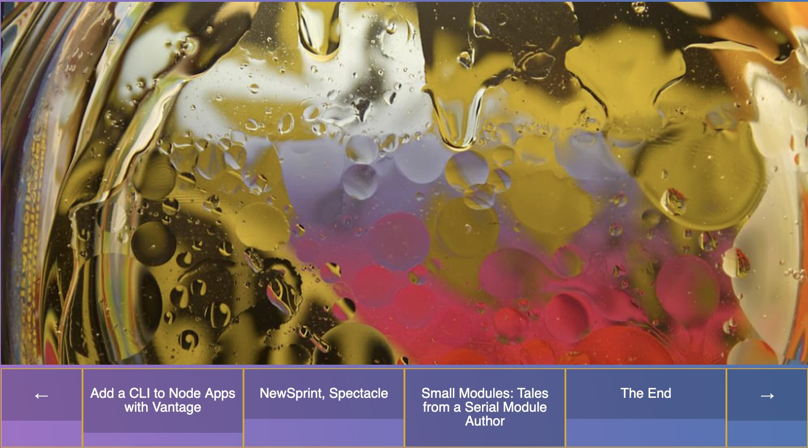
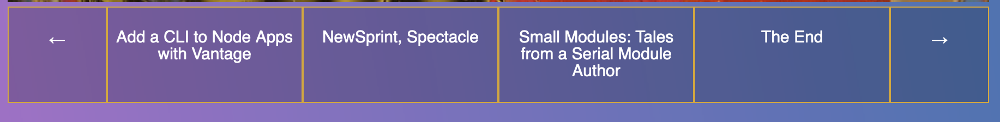
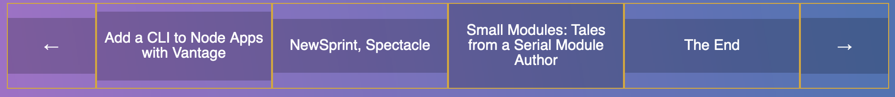
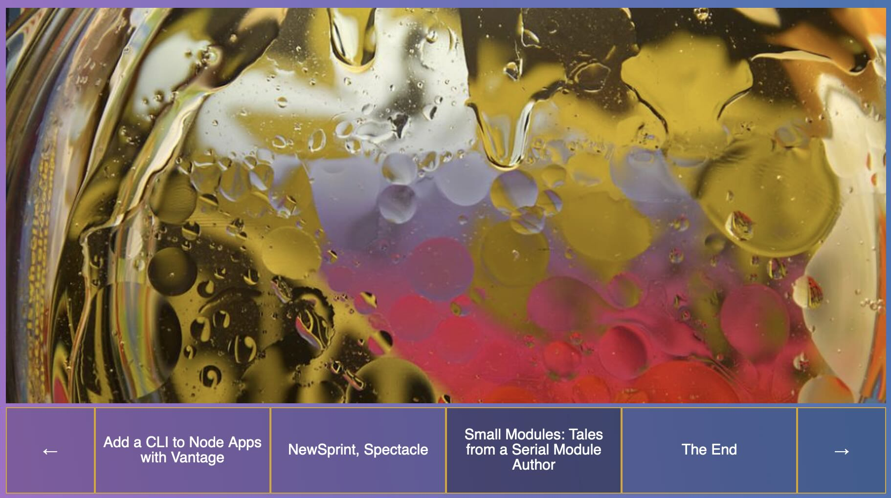

# Nesting Flexbox

We start with the following HTML:

```html
<!DOCTYPE html>
<html lang="en">
<head>
  <meta charset="UTF-8">
  <title>FlexBox Nav</title>
  <link rel="stylesheet" href="https://maxcdn.bootstrapcdn.com/font-awesome/4.3.0/css/font-awesome.min.css">
  <link rel="stylesheet" href="style.css">
</head>
<body>
  
  <div class="wrapper">
  
    <div class="slider">
      
    </div>

    <nav class="slider-nav">
      <ul>
        
        <li class="arrow">
          <a href="#">←</a>
        </li>
        
        <li>
          <a href="#">Add a CLI to Node Apps with Vantage</a>
        </li>
        
        <li>
          <a href="#">NewSprint, Spectacle</a>
        </li>
        
        <li>
          <a href="#">Small Modules: Tales from a Serial Module Author</a>
        </li>
        
        <li>
          <a href="#">The End</a>
        </li>
        
        <li class="arrow">
          <a href="#">→</a>
        </li>

      </ul>
    </nav>
  
  </div>
</body>
</html>
```

and CSS:

```css
/* Some CSS Setup - nothing to do with flexbox */
html {
  box-sizing: border-box;
}

*, *:before, *:after {
  box-sizing: inherit;
}

body {
  font-family: sans-serif;
  margin: 0;
  background-image: linear-gradient(260deg, #2376ae 0%, #c16ecf 100%);
}

.wrapper {
  max-width: 1000px;
  margin: 0 auto;
  padding:50px;
}

img {
  max-width:100%;
}

a {
  color:white;
  text-decoration: none;
  font-size: 15px;
  background:rgba(0,0,0,0.2);
  padding:20px 5px;
}
a:hover {
  background:rgba(0,0,0,0.4);
}


.slider-nav ul {
  list-style: none;
  margin: 0;
  padding: 0; 
}
```

giving us this beauty:


To give an idea of what we are going to do, I will just leave this image here:


## Flexbox inception
The `ul` is the the flex container while the `li` the flex items. Adding the following to our CSS:

```css
/* flex container */
.slider-nav ul {
  list-style: none;
  margin: 0;
  padding: 0;
  display: flex; 
}

/* flex item number 1 */
.slider-nav li {
  flex: 1;
  border: 1px solid goldenrod;
}

.slider-nav a {
  display: block;
  width: 100%;
}
```

We now are at this point:



The flex items, highlighted by a gold border, are containing links. What we want to do next is to have the links taking up the whole space inside the flex items and have the text centered vertically and horizontally. Finally, the arrows on each side should not take as much space.

```css
/* flex container */
.slider-nav ul {
  list-style: none;
  margin: 0;
  padding: 0;
  display: flex;
  align-items: center;
}

/* flex item number 1 */
.slider-nav li {
  flex: 2;
  border: 1px solid goldenrod;
  text-align: center;
}

.slider-nav .arrow {
  flex: 1;
}

.slider-nav a {
  display: block;
  width: 100%;
}
```



In the image above, the flex items are resized depending on how much content, the text here, there is inside of them. Now, with the property `align-items`, we could change `center` to `stretch`, giving us the following:



Now, the list items are taking as much space as the largest of them. `align-items: stretch` and `align-items: center` by themselves are not working in this context. We want the links to take up the whole space inside the flex items and have the text centered vertically and horizontally. To achieve this, we need to need a **nested flexbox**:

```css
/* flex container */
.slider-nav ul {
  list-style: none;
  margin: 0;
  padding: 0;
  display: flex;
}

/* flex item number 1 */
.slider-nav li {
  flex: 2;
  border: 1px solid goldenrod;
  text-align: center;
  display: flex;
}

.slider-nav .arrow {
  flex: 1;
}

.slider-nav a {
  display: block;
  width: 100%;
}
```

The flex item number 1, `.slider-nav li`, is now also flex container. This already gives some results:



With the `li` being now a flex containers, their children elements, the `a` are now flex items themselves! We now have the opportunity to do the following:

```css
/* flex container */
.slider-nav ul {
  list-style: none;
  margin: 0;
  padding: 0;
  display: flex;
}

/* flex item number 1 */
.slider-nav li {
  flex: 2;
  border: 1px solid goldenrod;
  text-align: center;
  display: flex;
  align-items: center;
}

.slider-nav .arrow {
  flex: 1;
}

.slider-nav a {
  flex-basis:100%;
}
```



Almost there! We still have the issue of the links not taking the whole space and of the centering of the text. The answer to this is to add another flex container. We add a `span` inside our `a` links:

```html
    <nav class="slider-nav">
      <ul>
        
        <li class="arrow">
          <a href="#"><span>←</span></a>
        </li>
        
        <li>
          <a href="#"><span></span>Add a CLI to Node Apps with Vantage</span></a>
        </li>
        
        <li>
          <a href="#"><span>NewSprint, Spectacle</span></a>
        </li>
        
        <li>
          <a href="#"><span>Small Modules: Tales from a Serial Module Author</span></a>
        </li>
        
        <li>
          <a href="#"><span>The End</span></a>
        </li>
        
        <li class="arrow">
          <a href="#"><span>→</span></a>
        </li>

      </ul>
    </nav>
```

is allows us now to turn `.slider-nav a` into a flex container and do:

```css
/* flex container */
.slider-nav ul {
  list-style: none;
  margin: 0;
  padding: 0;
  display: flex;
}

/* flex item number 1 */
.slider-nav li {
  flex: 2;
  border: 1px solid goldenrod;
  text-align: center;
  display: flex;
}

.slider-nav .arrow {
  flex: 1;
}

.slider-nav a {
  flex-basis:100%;
  display: flex;
  align-items: center;
}

/* flex items associated to the slider-nav a flex container */
.slider-nav span {
  display: block;
  width: 100%;
}
```

And now:



We're done!