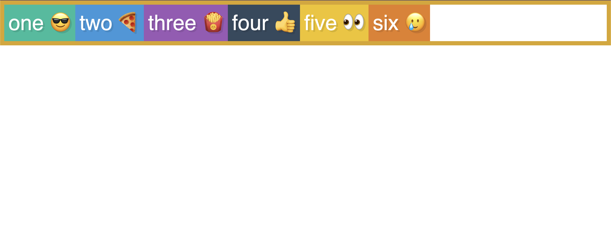
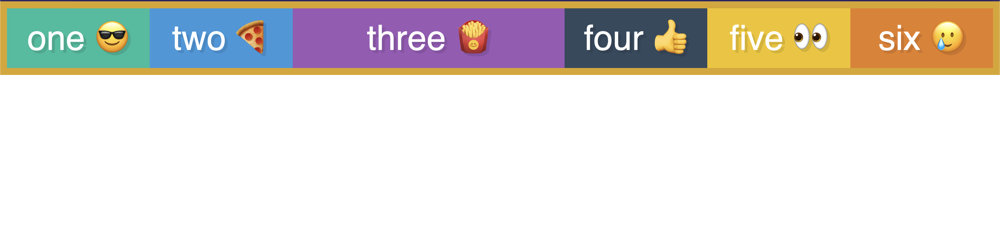

# About sizing and the `flex` property

We begin with the following: 



if we add the following lines to our starting CSS file:

```css
.box {
  flex:1;
}

.box3 {
  flex:2;
}
```

We then get the following:



This is saying that initially, all the boxes should be the same size when there is enough space. By adding a `flex:2` property for `box3`, we are overwriting the `flex:1` property set for all the boxes and saying that `box3` should be double the size of the others **if there is enough space.**